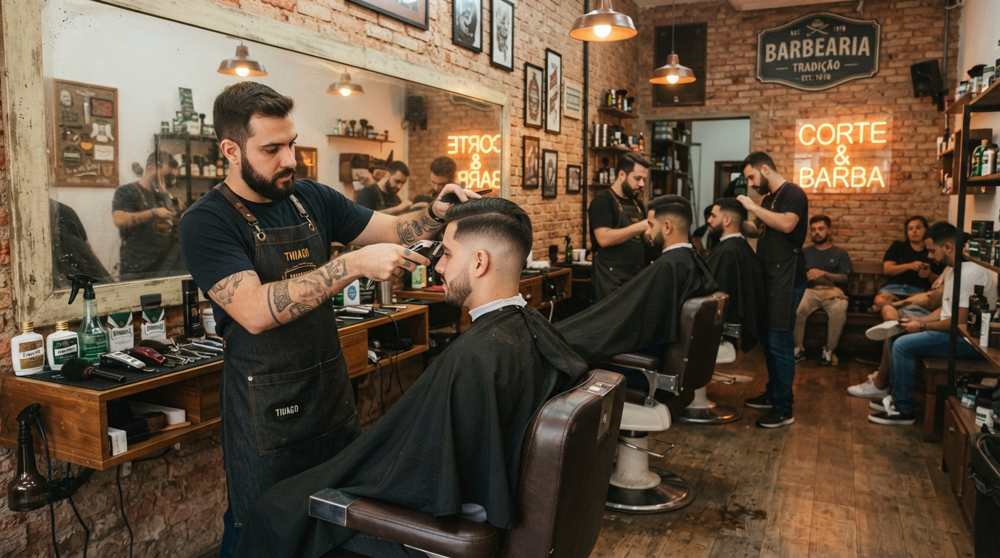

# Guia de Acessibilidade e Usabilidade - WR Barbearia (WCAG 2.2 AA)

A **WR Barbearia** é uma landing page institucional para uma barbearia de Maceió (AL). O objetivo é apresentar o trabalho do barbeiro, mostrar a localização e facilitar o agendamento de horários pelo WhatsApp.

**Requisitos do cliente:**
- Página simples, nas cores preto e branco
- Logotipo da barbearia presente
- Informações de contato para agendamento
- Fotos de cortes (selecionadas pelo cliente posteriormente)
- Detalhes sobre a localização

**Tecnologias utilizadas:**
- HTML
- CSS
- JavaScript (puro, sem frameworks)
- Google Fonts (Bebas Neue e Work Sans)
- Google Maps (mapa incorporado via iframe)

**Última atualização do documento:** 07/10/2026

> **Legenda de status:** ✓ Implementado | ⚠ Parcial / requer atenção | ✗ Pendente

---

### Organização de Pastas

```
seu-projeto/
├── index.html
├── style.css
├── script.js
└── assets/
    ├── logo.png
    ├── hero.jpg
    ├── corte1.jpg
    ├── corte2.jpg
    ├── corte3.jpg
    ├── corte4.jpg
    └── corte5.jpg
```

---

### Descrição das Camadas

#### HTML (`index.html`)
- Define o conteúdo e a estrutura semântica da página
- Cada seção tem um `id` usado pelo menu de navegação

**Seções da página:**
- `#inicio` → Hero (apresentação e chamada para agendar)
- `#galeria` → Fotos dos cortes
- `#localizacao` → Endereço, horário, WhatsApp e mapa
- `#contato` → Botão de WhatsApp e Instagram
- Rodapé com direitos autorais e link "Voltar ao topo"

#### CSS (`style.css`)
- Responsável por todo o visual
- Usa **variáveis CSS** (`:root`) para cores, fontes e espaçamentos
- Abordagem **mobile first**: a base cobre o celular e os `media queries` (`min-width`) adicionam o layout maior

**Paleta de cores (preto e branco):**

| Variável | Cor | Uso |
|---|---|---|
| `--black` | `#0d0d0d` | Texto, botões, seção de localização |
| `--black-soft` | `#171717` | Hover do botão de WhatsApp |
| `--white` | `#fafafa` | Fundo principal |
| `--off-white` | `#f2f1ee` | Fundo dos itens da galeria |
| `--gray-500` | `#7a7a7a` | Textos secundários |
| `--gray-300` | `#d9d8d4` | Textos sobre fundo escuro |
| `--gray-200` | `#e7e6e2` | Bordas |

**Breakpoints:**
- Base (até 480px) → celular, galeria em 2 colunas
- 481px → ajuste do espaçamento da galeria
- 721px → menu horizontal e galeria em 4 colunas
- 861px → localização com texto e mapa lado a lado

#### JavaScript (`script.js`)
- Monta os links do WhatsApp (botão e link da localização) com número e mensagem pré-definidos
- Controla o menu hambúrguer (abrir/fechar)
- Faz rolagem suave entre seções e fecha o menu ao clicar em um link
- Fecha o menu ao clicar fora dele
- Preenche o ano atual no rodapé

#### Imagens (`assets/`)
- Logotipo, imagem do hero e 5 fotos da galeria
- As fotos da galeria são provisórias: o cliente fará a seleção final

---

## Conformidade WCAG 2.2 Nível AA

### 1. CONTRASTE (1.4.3 - Contrast Minimum)
**Status:** ⚠ Parcial

**Verificações realizadas (valores calculados a partir das cores do CSS):**

- **Elemento:** Corpo / Header / Botão principal
  - Cor do Texto: #0d0d0d
  - Cor de Fundo: #fafafa
  - Contrast Ratio: 18.62:1
  - AA Normal: Pass
  - AAA Normal: Pass

- **Elemento:** Botão WhatsApp
  - Cor do Texto: #fafafa
  - Cor de Fundo: #0d0d0d
  - Contrast Ratio: 18.62:1
  - AA Normal: Pass
  - AAA Normal: Pass

- **Elemento:** Seção Localização (texto principal)
  - Cor do Texto: #fafafa
  - Cor de Fundo: #0d0d0d
  - Contrast Ratio: 18.62:1
  - AA Normal: Pass
  - AAA Normal: Pass

- **Elemento:** Seção Localização (rótulos: Endereço, Horário, WhatsApp)
  - Cor do Texto: #d9d8d4
  - Cor de Fundo: #0d0d0d
  - Contrast Ratio: 13.63:1
  - AA Normal: Pass
  - AAA Normal: Pass


**Pontos que exigem verificação manual:**
- Textos sobre a imagem do hero (título, kicker e parágrafo): o contraste depende da foto escolhida. O overlay escuro ajuda, mas deve ser testado com a imagem final.
- Legendas da galeria (`figcaption`): ficam sobre as fotos com degradê escuro. Testar com as fotos definitivas.

**Conclusão:**
- Contraste excelente na maior parte da página (preto e branco)

---

### 2. NAVEGAÇÃO POR TECLADO (2.1.1 - Keyboard)
**Status:** ⚠ Parcial

**Recursos:**
- ✓ Links, botões e menu são elementos nativos (`<a>` e `<button>`), acessíveis por `Tab`
- ✓ Navegação reversa com `Shift + Tab`
- ✓ Hambúrguer é um `<button>` real, com `aria-label`, `aria-expanded` e `aria-controls`
- ⚠ No celular, o menu fechado fica apenas transparente (`opacity: 0` e `pointer-events: none`), então os links continuam recebendo foco pelo teclado mesmo invisíveis
- ✗ O menu não fecha com a tecla `Esc`

**Teste:**

Pressione `Tab` e percorra toda a página em tela estreita, com o menu fechado.
O foco não deve passar por links invisíveis.

---

### 3. ALT EM IMAGENS (1.1.1 - Non-text Content)
**Status:** ✓ Implementado

**Exemplo:**
```html

```

**Boas práticas:**
- ✓ Todas as imagens possuem texto alternativo descritivo (logo, hero e as 5 fotos da galeria)
- ✓ O `iframe` do mapa tem `title="Localização da WR Barbearia"`
- ✓ O ícone SVG do WhatsApp usa `aria-hidden="true"`, pois o botão já tem texto
- ⚠ Ao trocar as fotos da galeria, lembrar de atualizar os `alt` para descrever a imagem real

---

### 4. LINKS E BOTÕES (2.4.4 - Link Purpose / 4.1.2 - Name, Role, Value)
**Status:** ✓ Implementado

**Características:**
- ✓ Textos de link claros ("Agendar horário", "Chamar no WhatsApp", "Ver no Google Maps")
- ✓ Links externos usam `rel="noopener noreferrer"`
- ⚠ Links que abrem em nova aba (`target="_blank"`) não avisam o usuário; recomenda-se indicar isso no texto ou em `aria-label`
- ⚠ Os links do WhatsApp começam com `href="#"` e só recebem o endereço correto via JavaScript. Sem JS, não funcionam

---

### 5. FOCO VISÍVEL (2.4.7 - Focus Visible)
**Status:** ⚠ Parcial

**CSS aplicado:**
```css
:focus-visible {
  outline: 2px solid var(--black);
  outline-offset: 3px;
}
```

**Resultado:**
- ✓ Foco visível nas áreas de fundo claro (contraste 18.62:1)
- ✗ Nas áreas escuras (seção Localização e hero) o contorno preto sobre fundo preto fica praticamente invisível (contraste 1:1)

**Correção sugerida:** usar contorno branco dentro das seções escuras.

---

### 6. HIERARQUIA DE TÍTULOS (1.3.1 - Info and Relationships)
**Status:** ✓ Implementado

**Estrutura usada:**
- h1 → título do hero ("Cada corte é uma questão de precisão.")
- h2 → títulos das seções (Galeria, Onde estamos, Contato)

**Observações:**
- ✓ Existe um único `h1`
- ✓ Não há saltos de nível

---

### 7. HTML SEMÂNTICO
**Status:** ✓ Implementado

**Uso correto de:**
- `<header>`
- `<nav>`
- `<main>`
- `<section>`
- `<footer>`
- `<figure>` e `<figcaption>` na galeria
- `<dl>`, `<dt>` e `<dd>` nas informações de localização

**Benefícios:**
- Melhor leitura por leitores de tela
- Melhor SEO
- Estrutura organizada

---

### 8. IDIOMA E METADADOS (3.1.1 - Language of Page)
**Status:** ✓ Implementado

- ✓ `<html lang="pt-BR">`
- ✓ `<title>` descritivo
- ✓ `meta description` preenchida
- ✓ `meta viewport` sem bloqueio de zoom

---

### 9. TIPOGRAFIA E LEGIBILIDADE
**Status:** ✓ Implementado

**Configurações:**
- Títulos: Bebas Neue (display)
- Corpo: Work Sans (sans-serif), com fallback do sistema
- Tamanhos em `rem` e `clamp()`, que escalam com a tela e com a preferência do usuário
- Line-height de 1.6 nos textos corridos
- Texto alinhado à esquerda, exceto na seção de contato (centralizada)

---

### 10. RESPONSIVIDADE (1.4.10 - Reflow)
**Status:** ✓ Implementado

**Recursos:**
- ✓ Layout mobile first
- ✓ Menu hambúrguer em telas pequenas
- ✓ Galeria muda de 2 para 4 colunas
- ✓ Mapa e informações lado a lado a partir de 861px
- ✓ Imagens com `max-width: 100%`

**Exemplo:**
```css
@media (min-width: 721px) {
  .gallery__grid { grid-template-columns: repeat(4, 1fr); }
}
```

---

### 11. MOVIMENTO REDUZIDO (2.3.3 / boas práticas)
**Status:** ✓ Implementado

```css
@media (prefers-reduced-motion: reduce) {
  html { scroll-behavior: auto; }
  * { animation-duration: 0.001ms !important; transition-duration: 0.001ms !important; }
}
```

- ✓ Quem desativa animações no sistema não recebe rolagem suave nem transições

---

### 12. TAMANHO DO ALVO (2.5.8 - Target Size Minimum, novo na WCAG 2.2)
**Status:** ✓ Implementado

- ✓ Botão hambúrguer: 34 x 34 px (mínimo exigido: 24 x 24 px)
- ✓ Botões principais com área de toque confortável
- ⚠ Links de texto do rodapé e do menu desktop são pequenos; conferir espaçamento entre eles

---

## CHECKLIST DE TESTES

### ⚠ Teclado
- Todos os links acessíveis
- Ordem lógica de navegação
- Foco visível nas seções escuras (**corrigir**)
- Menu mobile fechado sem foco em itens invisíveis (**corrigir**)

### ✓ Imagens e mídia
- Todas as imagens com `alt`
- Mapa com `title`

### ⚠ Contraste
- Texto principal > 4.5:1
- Texto cinza secundário abaixo de 4.5:1 (**corrigir**)
- Textos sobre fotos (testar com as imagens finais)

### ✓ Layout
- Funciona no celular
- Sem rolagem horizontal
- Conteúdo visível em todos os breakpoints

### ✓ Funcionalidades
- Botão do WhatsApp abre a conversa com mensagem pronta
- Link do Google Maps abre o endereço correto
- Instagram abre o perfil da barbearia
- Ano do rodapé atualiza automaticamente

---

## FERRAMENTAS DE TESTE

### Automáticas:
- Lighthouse (Chrome DevTools)
- Axe DevTools
- WAVE

### Manuais:
- Navegação por teclado (`Tab`, `Shift + Tab`, `Enter`, `Esc`)
- Teste visual de contraste com as fotos finais
- Zoom de 200% e 400% no navegador
- Teste em celulares reais (Android e iOS)
- Leitor de tela (NVDA ou TalkBack)

---

## PONTOS PENDENTES DO PROJETO

- Receber do cliente as fotos finais e atualizar os `alt` e legendas
- Informar os horários de funcionamento (hoje a página orienta consultar pelo WhatsApp)
- Remover da página o aviso "As fotos finais serão adicionadas pelo cliente", que é uma nota interna

---

## MELHORIAS FUTURAS

- Implementar **skip link** ("Pular para o conteúdo")
- Corrigir o foco visível nas seções escuras
- Esconder o menu mobile fechado com `visibility: hidden` e fechar com `Esc`
- Avisar quando um link abre em nova aba
- Adicionar um link de fallback para o WhatsApp direto no HTML (sem depender de JS)
- Adicionar favicon e imagem de compartilhamento (Open Graph)

---

## CONCLUSÃO

A landing page da **WR Barbearia** atende à maior parte das diretrizes da **WCAG 2.2 nível AA**, com:

- Boa legibilidade e alto contraste (preto e branco)
- HTML semântico e hierarquia de títulos correta
- Layout responsivo e mobile first
- Contato direto por WhatsApp, localização com mapa e Instagram

Restam quatro ajustes para a conformidade completa: contraste do cinza secundário, foco visível nas seções escuras, menu mobile fechado ainda focável e skip link.
